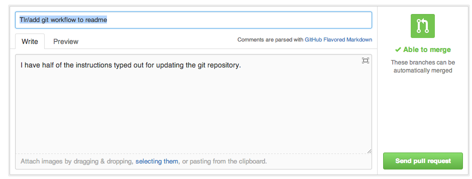

#Web Flashcards

#Git workflow

To understand git on a conceptual level, visit this [git visual demo](http://pcottle.github.io/learnGitBranching/), the most epic git tutorial on the web. 

We are chosing to work with a branching workflow. Every pair works in their own branch, and when we have our branch working to our satisfaction, we merge it into the master branch.

###Set up github repository

    Set up git repository and add everyone as collaborators. 

###Clone Repository onto everyone's local machine

    git clone https://github.com/KevinFalank/web_flashcards.git web_flashacards


### Commit 

    git add 
    git commit -v 
    
### Pull in changes other people have made.  

_Git is collaborative software, so people will add stuff when you are not looking. You'll want to check to for changes fairly often, and add them to your project. Use the git pull command to 'pull' the new shiny stuff into your copy._
    
    git pull 

### Create a new branch for new features

  _To create a new branch on the local machine, git checkout -b.  This creates a new branch. The branch should be named with your first three initials and the feature you are working on._ 

    git checkout -b TLR/Add-git-workflow-to-readme
    
_In this example, the branch is names TLR/Add-git-workflow-to-readme_
  
  Now follow the normal commit workflow until you have a feature.

  _To make the branch appear on github, use git push -u origin.  Instead of pushing to master, in the place where you would usually type master, type the name of your branch. This will create a new branch on the remote repository called TLR/awesome-git-workflow-readme._

    git push -u origin TLR/Add-git-workflow-to-readme
    
_Let's take apart this command._ 
  - 'push' takes your changes and shoves them into github. 
  - '-u' tells git, basically, "Hey, you know this thing named TLR/Add-git-workflow here on my computer?  You ought to make one on that faraway githup computer called TLR/Add-git-workflow.  And then you should connect the two, so that I don't have to wear my fingers out typing origin TLR/Add-git-workflow all the time.  This connection is called 'tracking.' My local TLR/whatever is 'tracking' my remote TLR/whatever, so that all i have to do is type git push when I want to give my remote all the shiny new bits of code I've added. 
  - 'origin' is the name of the computer out there in cloud-land that we are using to 'save' all our stuff. If I wanted to, I could name that computer 'cupcake.' 
  - 'TLR/Add-git-workflow-to-readme' is the name of my branch.  By default, on the remote computer it will also be named TLR/Add-git-workflow-to-readme.  However, if I wanted the remote computer to name this branch something else, I could give it a different name, like 'squirrel'.  To connect the two, in the branch name section I would say
  
````
   TLR/Add-git-workflow-to-readme:squirrel
````
  

After you have done a command with -u, when you are on this branch, you can just type 
  
    git push
    
    

### Create a pull request to merge two branches together.  

  1.To create a pull request, go to the github website.
  2. Click on a branch.

  3. A button will appear saying "compare and pull request". Click it.
  

  4. You will see a new screen asking you to write a pull request message.

  

  Github is smart, so it will look at your latest commit message.  The title of the pull request will be the first 80 characters of your commit message. The body of the pull request will be the rest of the commit message. If you wrote a good commit message, you can just press send pull request.

  

  5. The pull request is created. Someone can now review your code.

  6. Now pretend you are a code reviewer looking at a pull request. If there are no merge conflicts, you can press the merge pull request button.

  

  Once the branch is merged, there is generally no point in keeping around the old branch. If you do, it clutters up your local repository. So you can delete it to keep things nice and clean.

  

  If everyone works in their own file on the project, there will be no merge conflics. For right now, we will all work on our own files to avoid having to follow the merge conflict instructions below.


## Handling a merge conflict.  
  
  Before you push changes to the remote repository in the cloud, you will want to check and see if there are any big differences between what you have and what the remote repository has. Commit all of your changest to your local repository.  Then pull in Run 
  
     git pull

So, what do you do if you see the following? 
    
     Taras-MacBook-Air:web_flashcards tlroys$ git pull
     Auto-merging README.md
     CONFLICT (content): Merge conflict in README.md
     Automatic merge failed; fix conflicts and then commit the result.


This means that when I tried to stick all of the shiny new stuff from the cloud into my repository, somewhere someone wrote two things on the same line. Specifically, in the README, there are two different things that are trying to occupy the same place.  When two things try to occupy the same space, Git freaks out and tells us humans to deal with it. It presents us with the two things.  

    <<<<<<< HEAD
    ## Handling a pull request with merge conflicts. 
     
       So.  It happened.  Two people edited the same file and tried to merge it. Oh no!  What do you do
     
     =======
     ## Handling a pull request with merge conflicts.
    >>>>>>> d30ad19a99b65a94708662a971f467fc434faa19

Everything above the row of equals signs is one thing.  Everything below is the other thing.  Your mission, should you choose to accept it, is to choose what you actually want in that space. 

As it happens, I want the top bit. 

    ## Handling a pull request with merge conflicts. 
     
       So.  It happened.  Two people edited the same file and tried to merge it. Oh no!

After you decide what you want to keep, you delete everything else.
    

### Pulling one branch into another. 

to merge one branch into anohter, 

let's say you are on the branch TLR/stuff

To merge everythig in master into TLR/stuff, use the command 

     git merge master
     
This grabs everything from master and sticks it into TLR/stuff.  If there are merge conflicts, resolve them using the merge conflict procedure. 
